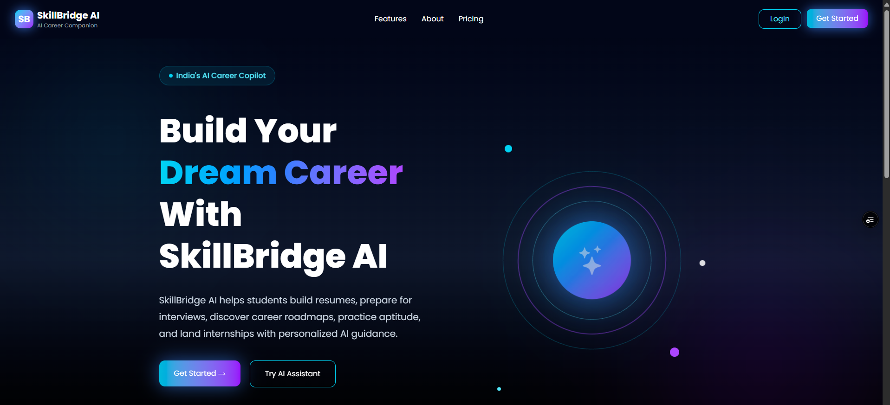
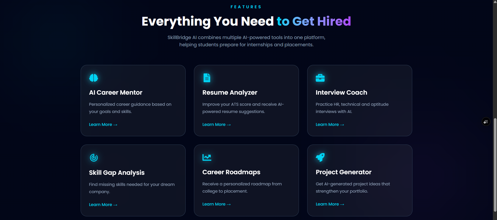
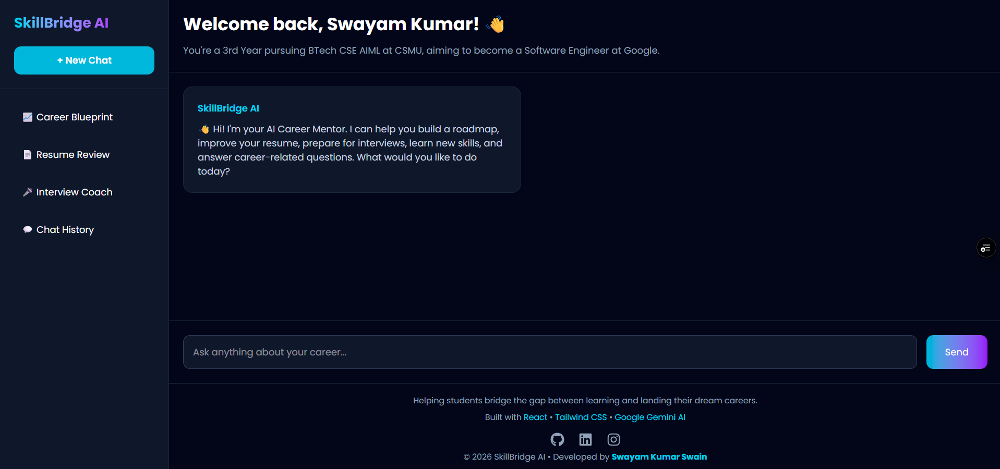

<h1 align="center">
🚀 SkillBridge AI
</h1>

<p align="center">
AI-powered Career Mentor built using React, Tailwind CSS and Google Gemini AI
</p>

<p align="center">


</p>

> Your AI-powered career mentor that helps students bridge the gap between learning and landing their dream careers.


---

## 🌐 Live Demo

🔗 **Website:** https://skill-bridge-ai-brown.vercel.app

---

## 📖 About

SkillBridge AI is an AI-powered career guidance platform designed to help students make informed career decisions.

After creating a personalized profile, users can chat with an AI mentor that understands their:

- 🎓 Degree
- 🏫 College
- 📚 Academic Year
- 💼 Dream Company
- 🎯 Career Goal
- 🛠 Skills

The AI provides personalized guidance, learning roadmaps, interview preparation, resume suggestions, and career advice.

---

# ✨ Features

- 🤖 AI Career Mentor powered by Google Gemini
- 👤 Personalized user profiles
- 💬 Interactive AI chat
- 📝 Markdown support
- 📋 Copy AI responses
- ⚡ Fast Vite + React architecture
- 📱 Fully responsive design
- 🎨 Modern UI with Tailwind CSS
- 📂 Sidebar navigation
- 🗑 Clear conversation
- ➕ Start new chat
- ⏳ Animated loading state

---

# 🛠 Tech Stack

| Technology | Purpose |
|------------|----------|
| React | Frontend |
| Vite | Build Tool |
| Tailwind CSS | Styling |
| Google Gemini API | AI Responses |
| React Markdown | Markdown Rendering |
| React Icons | Icons |
| Framer Motion | Animations |
| Vercel | Deployment |

---

# 📂 Project Structure

```text
src/
│
├── components/
│   ├── Navbar.jsx
│   ├── Hero.jsx
│   ├── Features.jsx
│   └── Footer.jsx
│
├── pages/
│   ├── Landing.jsx
│   ├── Setup.jsx
│   └── Chat.jsx
│
├── services/
│   └── gemini.js
│
├── App.jsx
└── main.jsx
```

---

# 🚀 Installation

Clone the repository

```bash
git clone https://github.com/Pixel-69/SkillBridgeAI.git
```

Move into the project

```bash
cd SkillBridgeAI
```

Install dependencies

```bash
npm install
```

Create a `.env` file

```env
VITE_GEMINI_API_KEY=YOUR_API_KEY
```

Start the development server

```bash
npm run dev
```

---

# 📸 Screenshots

## 🏠 Landing Page



---

## ✨ Features Section



---

## 💬 AI Career Chat




---

# 🔮 Future Improvements

- 💾 Save multiple chat conversations
- 📄 AI Resume Analyzer
- 🎯 Personalized Career Roadmaps
- 🎤 Mock Interview Simulator
- 📊 Skill Progress Tracking
- 🌙 Dark / Light Mode
- 🎙 Voice Chat
- 📁 Resume Upload
- 📈 Learning Dashboard

---

# 🤝 Contributing

Contributions, issues, and feature requests are welcome.

Feel free to fork the repository and submit a Pull Request.

---

# 👨‍💻 Developer

**Swayam Kumar Swain**

- GitHub: https://github.com/PixeL-69
- LinkedIn: https://www.linkedin.com/in/swayam-kumar-swain-6ab052296/

---

# ⭐ Support

If you found this project useful, consider giving it a ⭐ on GitHub.

It really helps!